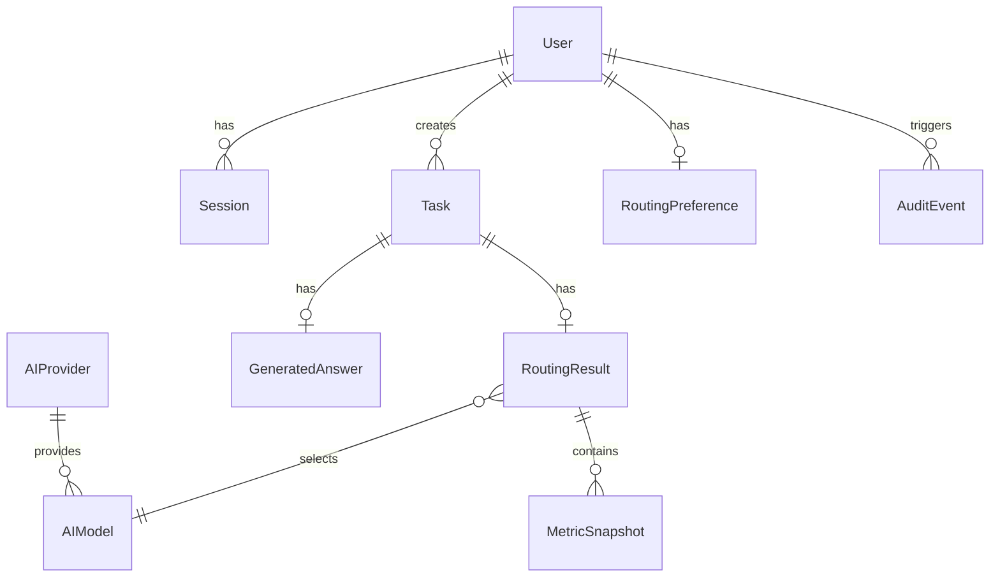

# Database Design — EcoRoute AI

## Entity Relationship Diagram

## Tables

### users
| Column | Type | Constraints |
|--------|------|-------------|
| id | UUID | PK, default uuid |
| email | VARCHAR(255) | UNIQUE, NOT NULL |
| password_hash | TEXT | NOT NULL |
| display_name | VARCHAR(100) | NOT NULL |
| role | ENUM(USER, ADMIN) | DEFAULT USER |
| status | ENUM(ACTIVE, SUSPENDED, DELETED) | DEFAULT ACTIVE |
| created_at | TIMESTAMP | DEFAULT now() |
| updated_at | TIMESTAMP | Auto-updated |

### sessions
| Column | Type | Constraints |
|--------|------|-------------|
| id | UUID | PK |
| user_id | UUID | FK → users(id) CASCADE |
| token_hash | VARCHAR(64) | NOT NULL, INDEX |
| expires_at | TIMESTAMP | NOT NULL |
| revoked_at | TIMESTAMP | NULL |
| created_at | TIMESTAMP | DEFAULT now() |

### tasks
| Column | Type | Constraints |
|--------|------|-------------|
| id | UUID | PK |
| user_id | UUID | FK → users(id) CASCADE, INDEX |
| input_text | TEXT | NOT NULL |
| status | ENUM | DEFAULT PENDING, INDEX |
| input_token_count | INT | NULL |
| created_at | TIMESTAMP | DEFAULT now(), INDEX |
| completed_at | TIMESTAMP | NULL |
| error_info | TEXT | NULL |

### routing_results
| Column | Type | Constraints |
|--------|------|-------------|
| id | UUID | PK |
| task_id | UUID | FK → tasks(id) CASCADE, UNIQUE |
| selected_model_id | UUID | FK → ai_models(id) |
| strategy | VARCHAR(50) | NOT NULL |
| estimated_tokens | INT | NOT NULL |
| actual_tokens | INT | NULL |
| estimated_cost_value | FLOAT | NULL |
| estimated_cost_currency | VARCHAR(3) | DEFAULT USD |
| actual_cost_value | FLOAT | NULL |
| energy_wh | FLOAT | NULL |
| carbon_grams | FLOAT | NULL |
| environmental_status | ENUM | DEFAULT ESTIMATED |
| methodology_version | VARCHAR(10) | DEFAULT v1 |
| quality_score | INT | NULL |
| quality_score_type | ENUM | DEFAULT SIMULATED |
| explanation | TEXT | NOT NULL |
| candidate_scores_json | TEXT | NULL |
| created_at | TIMESTAMP | DEFAULT now() |

### ai_providers / ai_models / routing_preferences / metric_snapshots / audit_events

See [prisma/schema.prisma](../prisma/schema.prisma) for complete schema definition.

## Indexes

- `users(email)` — UNIQUE
- `sessions(user_id)`, `sessions(token_hash)`
- `tasks(user_id)`, `tasks(created_at)`, `tasks(status)`
- `routing_results(task_id)` — UNIQUE
- `ai_models(provider_id, model_key)` — UNIQUE
- `audit_events(user_id)`, `audit_events(event_type)`, `audit_events(created_at)`

## Data Retention

Task data and routing results are retained indefinitely by default. Users can delete individual tasks. Account deletion removes all associated data via CASCADE rules.
